# Kết quả

> **Migration đầu tiên và cập nhật database**

> **API Tổng quát**

> **API lấy danh sách**
1. Lấy danh sách User chưa bị xóa mềm.

2. API lấy danh sách có phân trang bằng pageIndex = 2 và pageSize = 2.

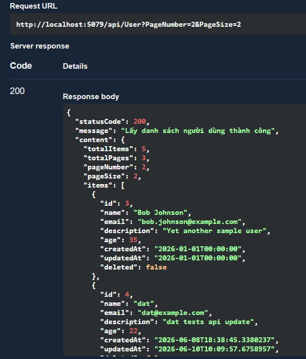

3. API lấy danh sách có sắp xếp theo Id, Name hoặc CreatedAt.

    3.1.Sắp xếp giảm dần theo Id
    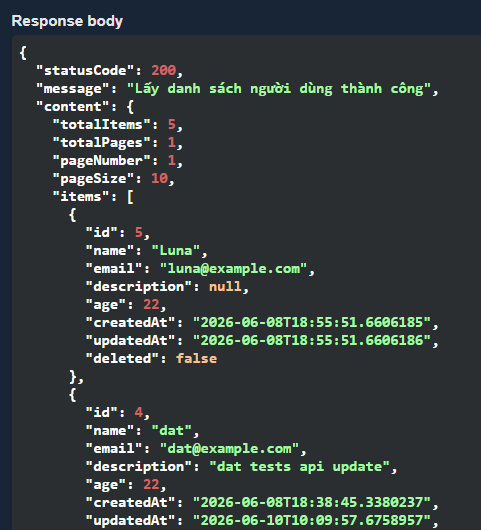
    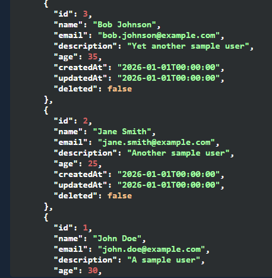
    
    3.2.Sắp xếp giảm dần theo Name
    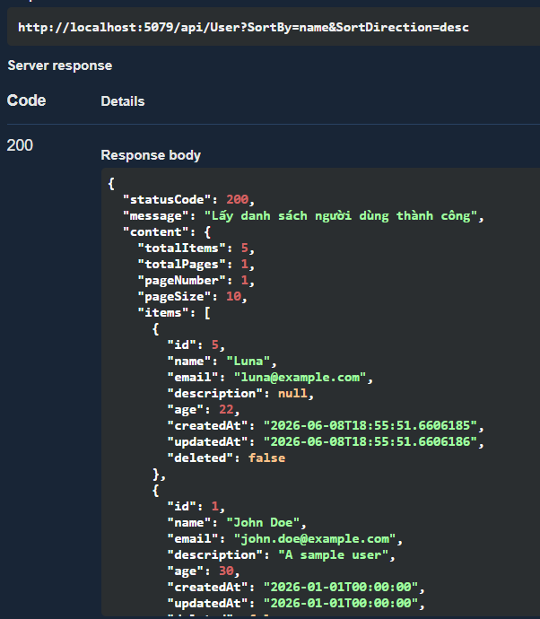
    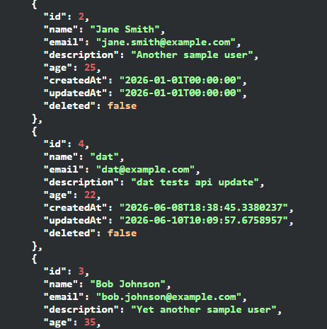
    
    3.3.Sắp xếp giảm đần theo CreatedAt 
    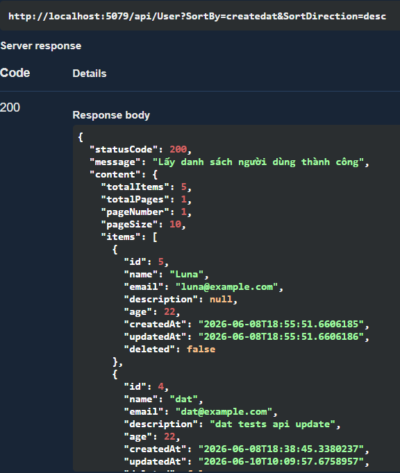
    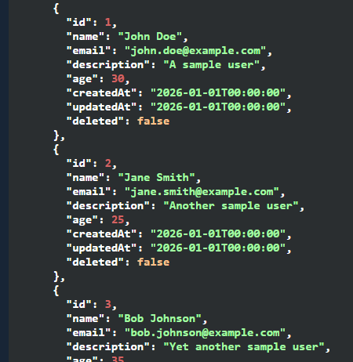
    
4. API lấy danh sách có tìm kiếm theo Name. 
    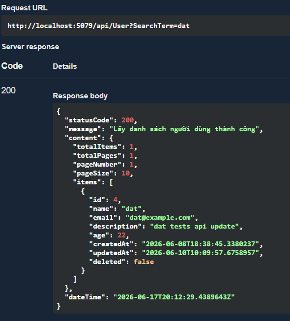

> **API lấy chi tiết**
    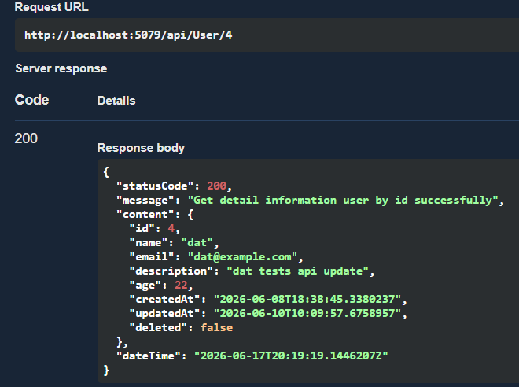

> **API thêm mới**
    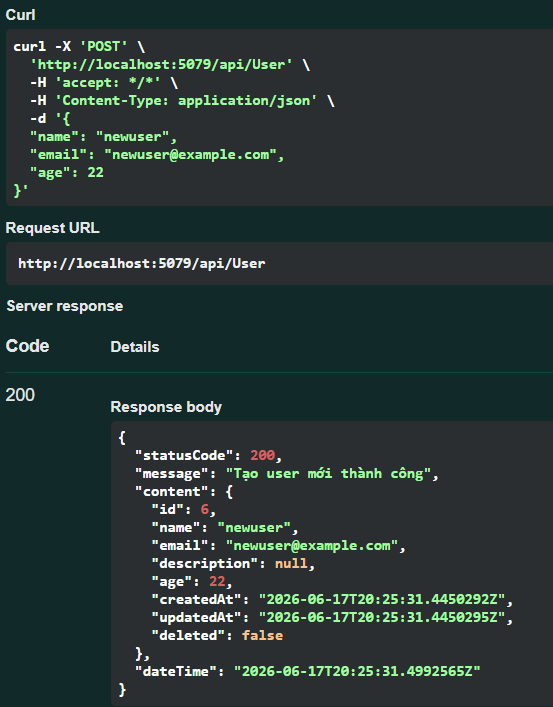

> **API cập nhật**
- Cập nhật user có id = 6
    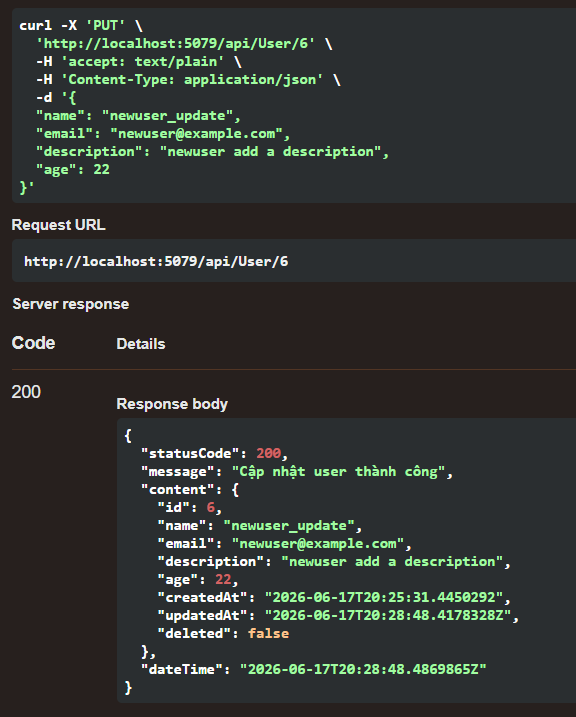

> **API xóa mềm**
- Xóa mềm user với id = 6
    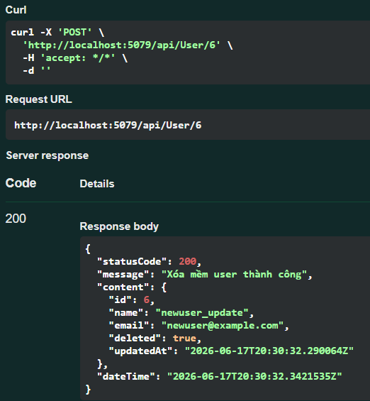

